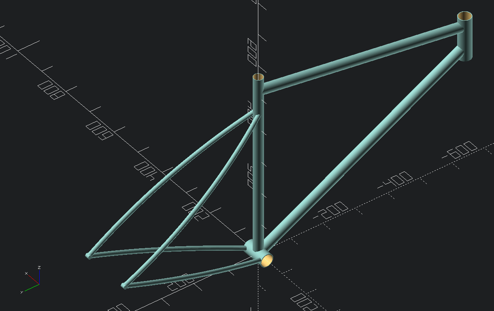

# bike

A ***\~\~work in progress\~\~*** hardtail / rigid bike frame design, produced in OpenSCAD, and  customized for specific measurements.

## Design Features

- EC34/EC34 Headset Compatibility [(Example)](https://www.whiteind.com/product/ec34-ec34/)
- BSA 73mm Threaded Bottom Bracket Shell [(Example: BB2012)](https://www.paragonmachineworks.com/bottom-bracket-shells/steel/steel-threaded-bb-shell-1-562-od.html)
- Planned: [GDH](https://velo-orange.com/blogs/theveloorangeblog/introducing-the-gdh-the-galactic-derailleur-hanger) derailleur hanger

## Sample Render

## Progress

### Completed

- [x] Front and rear triangle
- [x] Components are modularized, and measurements / transforms are defined per part
- [x] All components rendered with cuts so they can be rendered individually and 3D printed to use as live mocks
- [x] Seat stay / chain stay adjustments
  - [x] Ensure right (drive side) seatstay / chainstay is offset enough for freehub cassette
  - [x] Ensure width between stays matches freehub axle width (probably needs tweaking)
  - [x] Tweak length / positioning of stays for 27.5" wheels

### WIP
- [ ] Dropouts ?? (probably the "mount" piece just needs some modifications / cuts for axle)
- [ ] Derailleur hanger mount, planning on [GDH](https://velo-orange.com/blogs/theveloorangeblog/introducing-the-gdh-the-galactic-derailleur-hanger)
- [ ] Cable routing

### Planned Long-term Goals

- [ ] Have both rigid and suspension corrected versions

### Stretch Goals

- [ ] Create parent bike frame module that takes arbitrary geometry and material inputs, and adjusts rotations, offsets/translations, and part lengths to generate custom frames
